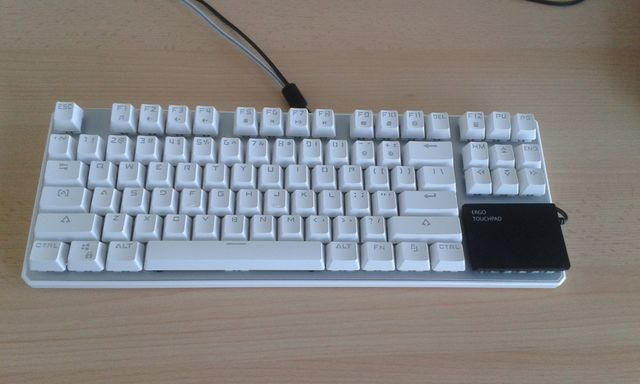
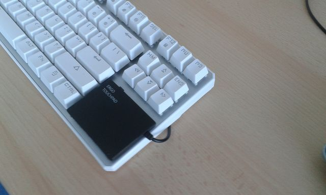

#USB HID Converter - Remap the keys of a USB Keyboard with 2 arduinos

#pdf conversion   
```
pandoc -s -o usb_hid_converter.pdf  -V geometry:"top=1cm, bottom=1cm, left=1cm, right=1cm" usb_hid_converter.txt
```


##Objectives   
My primary objective is to remap the keys of a USB Keyboard

As an example, the keyboard below is a modifed Lingyi Black Widow by 4 direction keys 




The following keys are remapped to suit my personal taste, and make space for a small touch pad. All this in a very compact keyboard that eliminates all mice on my desk.
```
Caps Lock 				to Left Mouse Click
Left Shift + Caps Lock 	to Right Mouse Click
F12						to Delete
Print Screen			to F12
Scroll Lock				to Page Up
Pause					to Page Down	
Insert					to Home
Home					to Arrow Up
Page Up					to End
Delete					to Arrow Left
End						to Arrow Down
Page Down				to Arrow Right
```



##Design Approach
Use a USB Host Shield to read the USB Keyboard from an Arduino Uno
Pass the keystrokes from the Uno to an Micro Pro using I2C, and emulate a keyboard + mouse on the Micro Pro

Note: I wish I could use the USB Host Shield directly on an Arduino Leonardo, emulate the keyboard on the Leonardo, and elimiate the Pro Micro completely.    
This remains to be done

##Hardware Assembly


The USB Host Shield fits naturally on top of the Micro
The Pro Micro is mounted on a third layer on top of hte USB Host Shield.

#Power Supply
The Pro Micro is connected to the target Host, and receives power from it
This power is passed to the USB Host Shield on the "third layer". This provides power to the UNO as well.   

##Schematic
The shematic below does not show the connection between the UNO and the USB Host Shield. They are simply plugged in on top of one another


##Arduino Sketches
There are 2 arduino sketches. First one is on the UNO, second one is on the Pro Micro

##Sketch on the Arduino Uno
The sketch on the Uno simply passed the USB reports from the keyboard, in an I2C message
Remember, the Uno receives the keyboard connection. but it is not connected to anywhere. It is very convenient to have a very basic sketch running there, which rarely needs to be modified or monitored.
It is possible to connect to a PC for monitoring, and investigating unusual USB reports


```
void kbd_poll(void)
{
	int count;
    byte rcode = 0;     

    rcode = Usb.inTransfer(KBD_ADDR, KBD_EP, 8, (char *)buf);
    if (rcode != 0) {
        //Serial.println("rcode is NOT 0");
	return;
    }

	Wire.beginTransmission(0x52);
	
	for (count=0; count<8; count++)
	{
  		retVal = Wire.write(buf[count]);
	}
  	retVal = Wire.endTransmission();

}
```

##Sketch on the Arduino Pro Micro
The sketch on the Pro Micro processes the keystrokes.
The Pro Micro is permanently connected to a PC, which makes it easy to debug, and update the sketch when necessary.

The basic logic is very simple. Read the 8 bytes from the I2C bus, and pass them to the host


```
void receiveEvent(int howMany) 
{
  
	KeyReport report;
	

	report.modifiers = Wire.read();  
	report.reserved = Wire.read();


  	for (int i=0; i<6; i++)
  	{
		curByte = Wire.read();
  		report.keys[i] = hidLookup[curByte];  
  	}

	Keyboard.sendReport(&report);

}
```
The hidLookup is a lookup tables, 
It is initialized to a pass through in setup(), 


 
```
	for(int i=0; i<256; i++)
	{
		hidLookup[i] = i;
	}
```

and remaps the keystrokes as required


```
	// LingYi Customisation - hid reports
	hidLookup[0x45] = 0x4c;		// F12 - is now Delete
	hidLookup[0x46] = 0x45;		//Print Screen is now F12
	hidLookup[0x47] = 0x4b;		// Scroll Lock is now Page Up
	hidLookup[0x48] = 0x4e;		// Pause Break is now Page Down
	hidLookup[0x49] = 0x4a;		// Insert is now Home
	hidLookup[0x4a] = 0x52;		// Home is now up arrow
	hidLookup[0x4b] = 0x4d;		// Page Up is now End
	hidLookup[0x4c] = 0x50;		// Delete  is now left arrow
	hidLookup[0x4d] = 0x5a;		// End is now down arrow
	hidLookup[0x4e] = 0x4f;		// Page Down is now right arrow
```

There is some extra complexity around the caps lock, and left shift. These are transated into left and right mouse click, and are passed to the host using the Mouse library, 
instead of raw hid reports for simplicity.
For generating release events, the system must remember the previous status of the mouse: the mouse release event must be sent only the first time the mouse is not pressed, 
and only if it was pressed before. But this is just some extra logic.


